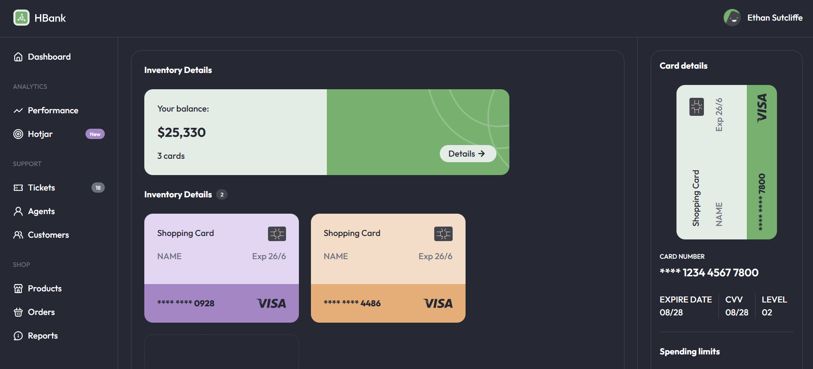

# Bank Dashboard

Este proyecto es una interfaz de usuario para un panel de control de un banco ficticio llamado HBank. Está diseñado con Tailwind CSS y contiene un diseño responsive con secciones para la gestión de tarjetas, detalles de inventario, transacciones y navegación del usuario.

## Vista Previa



Puedes ver la versión demo en vivo aquí: [Bank Dashboard](https://ibrahim-003.github.io/Bank-Dashboard/)

## Características

- **Cabecera**: Contiene el logo de HBank y el avatar del usuario con su nombre.
- **Sección principal**:
  - **Detalles de Tarjeta**: Muestra la información de la tarjeta activa del usuario, incluyendo el número de tarjeta, fecha de expiración, CVV, y nivel.
  - **Límites de Gasto**: Permite al usuario visualizar el límite diario de transacciones y el gasto acumulado.
  - **Detalles de Inventario**: Despliega el saldo total, la cantidad de tarjetas activas y opciones para ver detalles.
  - **Estadísticas de Transacciones**: Incluye secciones para ver las ganancias, gastos y objetivos.
- **Navegación**:
  - **Menú Lateral**: En dispositivos de escritorio, se presenta un menú con secciones de análisis, soporte y tienda.
  - **Menú Colapsado**: En dispositivos móviles, el menú se reduce a iconos para una mejor visualización en pantallas pequeñas.


## Estructura de Archivos

```
|-- index.html                # Página principal
|-- assets/
    |-- images/
    |   |-- ico.svg                     # Icono de la página
    |   | ...
```

## Instalación

1. Clona este repositorio en tu máquina local:
   ```bash
   git clone https://github.com/Ibrahim-003/Bank-Dashboard.git
   ```
2. Asegúrate de tener conexión a Internet para cargar las fuentes desde Google Fonts y Tailwind CSS.
3. Abre `index.html` en tu navegador para ver la página.

## Tecnologías Utilizadas

- HTML5
- Tailwind CSS
- Google Fonts

## Autor

Este proyecto fue creado por [Ibrahim Almeyda].
